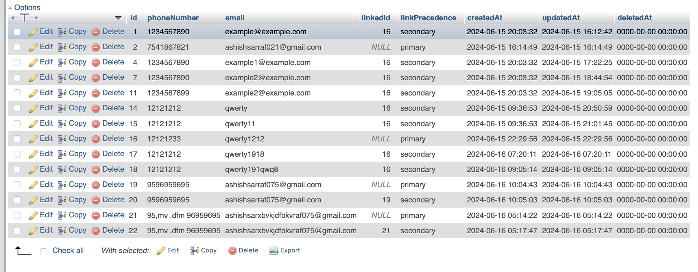
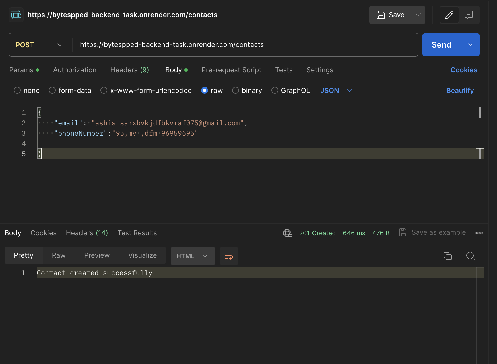

Certainly! Here's an extended version of the README file with setup instructions for the Node.js project using Express and MySQL:

---

# Bitespeed Backend Task: Identity Reconciliation

Bitespeed requires a solution to manage and consolidate customer identities across multiple purchases on FluxKart.com. This project aims to reconcile customer contacts using email and phone numbers, storing data in a relational database table named Contact.

## Project Overview

### Requirements

1. **Web Service Endpoint:** Implement a POST endpoint `/identify` that accepts JSON payloads with optional `email` and `phoneNumber` fields.
2. **Consolidation Logic:** Return a consolidated view of customer contacts in the specified JSON format.
3. **Primary and Secondary Contacts:**
   - Identify primary contacts as the oldest entry for each unique customer.
   - Secondary contacts are subsequent entries linked to primary contacts via shared email or phone number.

### Example Usage

#### Request Format:
```json
{
  "email": "mcfly@hillvalley.edu",
  "phoneNumber": "123456"
}
```

#### Response Format:
```json
{
  "contact": {
    "primaryContactId": 1,
    "emails": ["lorraine@hillvalley.edu", "mcfly@hillvalley.edu"],
    "phoneNumbers": ["123456"],
    "secondaryContactIds": [23]
  }
}
```

### Creating New Contacts

- If no existing contacts match the request, a new primary contact is created.
- Secondary contacts are created if new information matches existing primary contacts.

### Setup Instructions

1. **Clone the Repository:**
   ```bash
   git clone https://github.com/your/repository.git
   cd project-directory
   ```

2. **Initialize Node.js Project:**
   ```bash
   npm init -y
   ```

3. **Install Dependencies:**
   ```bash
   npm install express mysql2 dotenv
   ```

4. **Setup MySQL Database:**

   - Ensure MySQL server is installed and running.
   - Create a new database named `user_data`.
   - Create a `.env` file in the root directory of your project and add the following configuration:
     ```plaintext
     DB_HOST=localhost
     DB_USER=root
     DB_PASSWORD=your_password
     DB_NAME=user_data
     ```

5. **Environment Variables:**
   - Modify the `.env` file with your MySQL database credentials.

6. **Run the Application:**
   ```bash
   node app.js
   ```

7. **Making Requests:**

   - **POST Request:** Send a JSON payload to `/identify` with `"email"` and/or `"phoneNumber"` fields.
   - **GET Request:** Pass parameters to retrieve specific contact information.

   Example POST request:
   ```json
   {
     "email": "ashishsarxbvkjdfbkvraf075@gmail.com",
     "phoneNumber": "956969695"
   }
   ```

   Example GET request:
   ```
   /contacts?phoneNumber=123456
   ```

### Deployment

The project is hosted using Render at [https://bytespped-backend-task.onrender.com/contacts](https://bytespped-backend-task.onrender.com/contacts).


### Images 




---

This README provides an overview of the project, its requirements, setup instructions for Node.js and MySQL, usage examples, and deployment details. For detailed implementation, refer to the project files and documentation.

--- 

